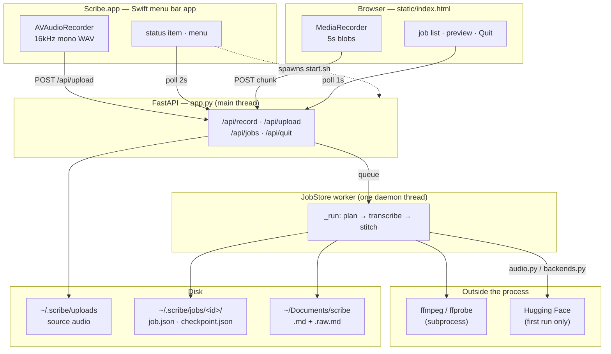

# Architecture

How the code is laid out and how one recording becomes two markdown files.

This is the *what and where*. The **why** — why silence is skipped, why the raw
and cleaned pair exists — is in the [README](../README.md); it isn't repeated
here.

Roughly 2,200 lines total. Eight Python modules and one HTML file, no
frameworks beyond FastAPI, no build step, no database.

## The modules

| File | Responsible for |
|---|---|
| `scribe/app.py` | Every HTTP route, plus the `lifespan` startup checks. Holds the single global `store = JobStore()`. |
| `scribe/jobs.py` | The largest and most important module. `Job`, `JobStore`, the worker thread, checkpointing, the repeat filter, all export formats, writing markdown to disk. |
| `scribe/audio.py` | Everything upstream of a model: ffmpeg ingest, `silencedetect` parsing, and the speech-only chunk planner. |
| `scribe/backends.py` | Three transcription engines behind one `Backend` Protocol, plus `build_backend` and its instance cache. |
| `scribe/clean.py` | Filler-word stripping and assembling segments into paragraphs. Pure text, no I/O. |
| `scribe/settings.py` | Loads the two config files, merges defaults, builds the decoder prompt. |
| `scribe/static/index.html` | The entire front end — markup, CSS and JS in one file. No build, no dependencies. |
| `start.sh` | Bootstrap and launch: PATH, interpreter choice, venv, dependency install, port lock, browser. |
| `ScribeApp/Sources/Scribe/` | The native menu bar app, ~900 lines of Swift. Documented separately in [MENUBAR_APP.md](MENUBAR_APP.md). |

`scribe/config.toml` and `scribe/presets.toml` are configuration, not code —
see [DEVELOPMENT.md](DEVELOPMENT.md) for which belongs where.

## Components

**Two clients, one engine.** `Scribe.app` (native, records with
`AVAudioRecorder`) and the web UI (records with `MediaRecorder`) both end at the
same `/api/upload`. The pipeline cannot tell them apart, which is why a server
change reaches both. The app additionally *owns* the engine process — it spawns
`start.sh` on launch and stops it on quit. See [MENUBAR_APP.md](MENUBAR_APP.md).

Two threads and one queue. The HTTP layer never transcribes; it only enqueues.
That is why a 90-minute job doesn't block the UI, and why polling once a second
is adequate — see the module docstring in `app.py`.

## End to end: one recording

Trace of a browser recording, from pressing Record to files on disk.

**1 — Capture.** `MediaRecorder` emits a blob every 5 s
(`recorder.start(5000)`). Each is `POST`ed to `/api/record/{id}/chunk` and
appended to a single file, so the tab never holds the whole session. Uploads are
*chained* (`uploads = uploads.then(...)`), not fired in parallel — order matters
because they append to one file.

**2 — Finish.** `onstop` **awaits the upload chain**, then calls
`/api/record/{id}/finish`. `app._rec_path` globs for `rec-<id>.*` — the
extension came from the `Content-Type` the browser sent, since Chrome gives WebM
and Safari MP4.

**3 — Submit.** `app._submit` → `JobStore.submit` (`jobs.py:150`) creates a
`Job` with a fresh 12-char uuid, makes `~/.scribe/jobs/<id>/`, writes
`job.json`, and puts the id on the queue. The HTTP request returns here.

**4 — Decode.** The worker picks it up in `JobStore._run` (`jobs.py:216`).
`audio.to_wav` shells out to ffmpeg for 16 kHz mono PCM; `audio.duration` uses
ffprobe.

**5 — Plan.** `audio.detect_silences` parses `silencedetect` output from
stderr. `audio.plan_chunks` inverts those spans into speech regions and packs
them into `Chunk`s, marking `para_break` where a gap exceeded `paragraph_gap`.
Silence is *skipped*, never sliced.

**6 — Transcribe.** Per chunk: `audio.slice_wav` cuts it out, then
`backend.transcribe(wav, language, prompt)`. Results are shifted back onto the
original timeline with `Segment.shifted(chunk.start)` and appended to
`checkpoint.json` immediately. The chunk wav is deleted in a `finally`.

**7 — Stitch and clean.** `_drop_repeats` removes cross-chunk repetition loops
and remaps the paragraph-break indices. `clean.to_paragraphs` joins segments
into paragraphs at those breaks.

**8 — Write.** `_write_markdown` renders both versions — `export(job, "md")`
cleaned and `export(job, "raw")` verbatim — into the output folder as
`YYYY-MM-DD-HHMM-<slug>.md` and `.raw.md`. The decoded PCM is then deleted
(~115 MB/hour); the original upload stays for playback.

An uploaded file skips steps 1–2 and enters at `/api/upload`. Everything
downstream is identical.

## Data structures

| Type | Defined at | Notes |
|---|---|---|
| `Segment` | `backends.py:24` | `start`, `end`, `text`. The one type every backend must return. `shifted()` is how chunk-local times become absolute. |
| `Chunk` | `audio.py:120` | Frozen. `index`, `start`, `end`, `para_break`. Times are on the **original** timeline even though silence was skipped. |
| `Job` | `jobs.py:35` | Everything about one transcription, including `segments` and `breaks`. `save()`/`load()` are the disk format. |
| config `dict` | `settings.py:_DEFAULTS` | Plain nested dict, not a class. `load_config()` deep-merges the TOML over these defaults. |

`Job.as_dict()` (`jobs.py:110`) is the wire format the front end consumes — if
you add a field the UI needs, it goes there.

## What it talks to

- **ffmpeg / ffprobe** — subprocess, via `audio._run`. Hard requirement, checked
  at startup by `audio.check_tools()`.
- **Hugging Face** — only on first use of a model. `mlx_whisper` downloads
  lazily inside the first `transcribe()` call, which is why the job stage says
  "loading model" rather than appearing to hang.
- **MLX / Metal** — Apple Silicon only.
- **The filesystem** — three locations: `~/.scribe/uploads` (source audio),
  `~/.scribe/jobs/<id>/` (`job.json`, `checkpoint.json`), and the configured
  output folder.

No database, no external API, no telemetry. The server binds `127.0.0.1` only.

The UI makes no third-party requests either: Archivo is bundled in
`scribe/static/fonts/` and mounted at `/fonts`. It was previously pulled from
`fonts.googleapis.com`, which disclosed the viewer's IP to Google on every page
load — the one place the app reached outside the machine.

## State and persistence

Jobs live in memory in `JobStore._jobs` **and** on disk as
`~/.scribe/jobs/<id>/job.json`. `JobStore._restore()` reloads them at startup
and downgrades anything left `running` or `queued` to `failed`, so an
interrupted job comes back resumable instead of showing a progress bar that
never moves.

The loaded model is *not* kept forever: `backends.release_idle` unloads it
after `unload_after_minutes` of an empty queue, freeing ~1.5 GB. That exists
because the menu bar app keeps this process alive for days.

`checkpoint.json` is separate and per-chunk: it's what makes **Resume** cheap.
The coupling between it and `retry()` is subtle and easy to break — see gotcha
#2 in [DEVELOPMENT.md](DEVELOPMENT.md).
